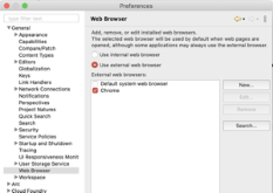

### Web Programming 준비

### 1.코딩을 할 수 있는 IDE 또는 Editor -> Eclipse

### 2.출력되는 결과를 확인하기 위한 Web Browser
* HTML5 를 확인하기 위해서는 IE 보다는 Chrome 
> Chrome 보다는 Firefox 나 Opera 브라우저가 조금 더 잘 지원  

### 3.2번까지만 있으면 html을 만들어서 결과 확인은 가능  

### 4.만들어진 결과를 배포하고자 하면 Web Server가 있어야 합니다.  

### 5.Back End 언어로 만들어진 내용을 브라우저를 이용해서 확인하고자 하는 경우에는 WAS(Web Application Server - Web Containder)가 있어야 합니다.  

> WAS는 웹 서버의 요청을 받아서 Back End 언어로 처리한 결과를 HTML로 변환하는 역할을 수행해주는 프로그램  
> Java 용 WAS 중에서 가장 유명한 프로그램이 apache tomcat 이고 국내 공공기관 SI에서는 티맥스에서 만든 제우스를 많이 사용합니다.  
> 기업들은 사용하는 WAS가 다양합니다.  

## WAS - Tomcat 설치

* windows의 경우는 installer 버전을 다운로드 받아서 설치 가능
* 나머지 운영체제는 압축된 버전을 다운로드 받아서 압축을 해제한 후 실행할 때 연결해서 사용(startup.sh 또는 startup.bat)

### 1.http://tomcat.apache.org/ 에서 다운로드

### 2.설치

* windows에서 oracle이 설치된 상태에서 tomcat을 설치할 때는 되도록 포트번호를 변경해주는 것이 좋습니다.
* oracle이 8080번 포트를 사용하는데 tomcat의 기본포트가 8080번입니다.

> 포트충돌이 발생해서 tomcat이 제대로 구동되지 않을 수 있습니다.

* 압축된 파일의 경우는 압축을 해제하는 것으로 설치가 끝난 것입니다.

## Eclipse 환경설정

* 대다수의 IDE는 워크스페이스 단위로 환경설정을 합니다.
* 워크스페이스를 변경하면 이전 환경설정은 사라지게 됩니다.
* web programming 할 때는 encoding 방식을  utf-8로 설정하고 출력하는 브라우저를 설정을 합니다.

### 1.출력 브라우저 변경
[Window] - [Preferences] - [Appearance] - [Web Browser]에서 설정

### 2.[Appearance] -[workspace]에서 text file encoding을 utf-8로 변경

### 3.[Web]에서 html, css, jsp 의 encoding을 utf-8로 변경

> 브라우저에서 한글이 깨지면 이 설정을 확인

### 4.Mac에서는 encoding 설정을 할 필요 없음