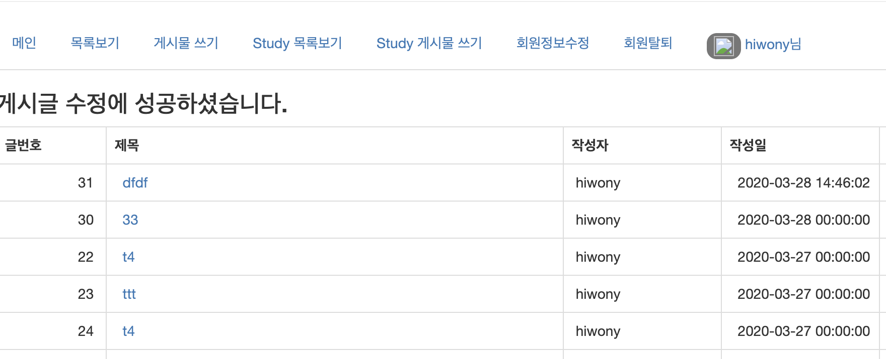

03/28 토

### 게시글 작성 일자 및 시간 출력 수정 

* 게시글 작성 일자만 출력되서  작성 일자 및 시간도 출력하게 수정하였다. 

* 포맷 형식  `yyyy-MM-dd HH:mm:ss`




### 1. DB Table에 regdate, updatedate 컬럼 자료형타입을 수정하자.

* 이미 만들어진 table이라 `alter table`을 이용하여 타입 변경을 해줬다.

```sql
  regdate date default now(), 
	updatedate date default now(), 
```

* 위에 두 컬럼을 아래 구문을 통해서 변경하였다.

```sql
alter table springboard modify regdate datetime default now();
alter table springboard modify updatedate datetime default now();
```

* 여기서 잠깐 tip

oracle은 sysdate 라는 자료형타입이이 있지만 우리의 Mysql 은 비슷한 자료형으로는  `datetime`, `timestamp` 두가지가 있다 .

하지만 두가지 자료형 다 각기 다른 특성을 가지고 있으니 참고자료를 통해서 확인해보자 

| 구분         | datetime                                  | timestamp                                                    |
| ------------ | ----------------------------------------- | ------------------------------------------------------------ |
| 지원범위     | 1000-01-01 00:00:00 ~ 9999-12-31 23:59:59 | 1970-01-01 00:00:00  ~ 2037-12-31 23:59:59                   |
| DB저장될때   | 문자형으로 저장                           | 숫자형으로 변환되서 저장                                     |
| 저장공간크기 | 8byte                                     | 4byte                                                        |
| 자동입력여부 | 수정할 일이 있으면 그때마다 날짜를 입력   | 날짜를 따로 입력 안해줘도 자동으로 입력이 가능<br/> (CURRENT_TIMESTAMP 사용시 ) |

출처: https://devx.tistory.com/entry/datetime과-timestamp의-차이  [Meta Developer Story]


### 2. BoardServiceImpl 전체 불러오기 code 수정

```java
	@Override
	public List<Board> list() {
		List<Board> list = boardDao.list();
		Calendar cal = Calendar.getInstance();
		SimpleDateFormat sdf = new SimpleDateFormat("yyyy-MM-dd HH:mm:ss.SSS");
		String strDate = sdf.format(cal.getTime());

		for (Board vo : list) {
			if (strDate.toString().equals(vo.getRegdate().substring(0, 19))) {
				vo.setDispdate(vo.getRegdate().substring(20));
			} else {
				vo.setDispdate(vo.getRegdate().substring(0, 19));
			}
		}
		return list;
	}
```

substring 으로는 Date 타입의 자료형을 잘라낼수가 없어서 `simpleDateFormat` 을 이용해서 포맷형식을 지정 해줬었다. 

앞의 `YYYY-MM-dd` 이 포맷만 잘라내는 거였는데  `yyyy-MM-dd HH:mm:ss` 여기까지 잘라내자 

잘라낸 날짜 시간을 DB로 쏴주는거다. 


