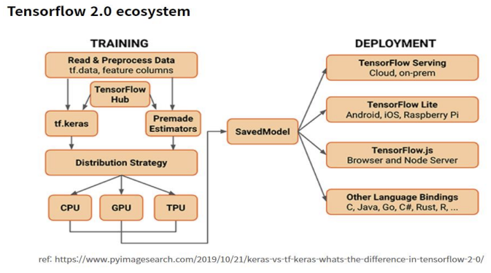

# Tensorflow2.0

### 1. 주요기능


#### 1) Eager execution - 즉시 실행

* Eager execution은 더 파이썬적인(Pythonic) 방식으로 전체 그래프를 생성하지 않고 함수를 바로 실행하는 명령형 프로그래밍 환경이다. 동적으로 계산 그래프를 작동하는 방식이다.

#### 2) Automatic differentiation – 자동 미분

* 자동 미분은 인공신경망 훈련을 위핚 역젂파를 구현하는데 유용하다.

#### 3) Subclassing - 새로운 모델 생성 방법

* keras에서는 2가지 방법으로 모델을 만들 수 있었지만, tf.keras에서는 3가지 방법으로 만들 수 있다.

`Sequential` , `Function` , `Subclassing`

#### 4) MirroredStrategy - multi-GPU와 동기 분산 학습 지원

* MirroredStrategy는 한 시스템의 multiGPU 및 동기식 분산 학습을 서포트핚다.


### 2. ecosystem




### 3. 구성요소

#### 1) 텐서플로우 코어(Tensorflow core)

* 머신러닝 모델을 개발하고 학습시키기 위한 오픈소스 라이브러리

#### 2) Tensorflow.js

* 브라우저와 Node.js에서 모델을 학습 및 배포하기 위한 자바스크립트 라이브러리

```html
<!doctype html>
<html>
<head>
    <title>TF.js Test</title>
    <script src="https://cdn.jsdelivr.net/npm/@tensorflow/tfjs@0.6.1"></script>
    <script type="text/javascript">
        
        // 선형회귀 모델 생성
        const model = tf.sequential();
        model.add(tf.layers.dense({units: 1, inputShape: [1]}));
        
        // 학습을 위한 준비 : 손실 함수와 최적화 함수를 설정
        model.compile({loss: 'meanSquaredError', optimizer: 'sgd'});
        
        // 학습 데이터 생성
        const xs = tf.tensor2d([1, 2, 3, 4], [4, 1]);
        const ys = tf.tensor2d([1, 3, 5, 7], [4, 1]);
        
        // 데이터를 사용해서 학습
        model.fit(xs, ys).then(() => {
            // 학습된 모델을 가지고 추론
            model.predict(tf.tensor2d([7], [1, 1])).print();
        });
    </script>
</head>
<body>
    콘솔을 확인하세요.
</body>
</html>
```


#### 3) 텐서플로우 라이트(Tensorflow Lite)

* 모바일 및 임베디드 디바이스에 모델을 배포하기 위한 가벼운 라이브러리

#### 4) 텐서플로우 익스텐디드(TensorFlow Extended, TFX)

* 대규모 프로덕션 환경에서 데이터를 준비하고 모델을 학습, 검증, 배포하기 위한 플랫폼
