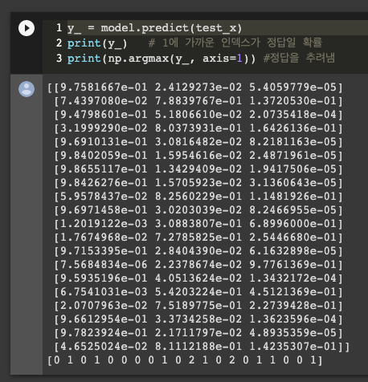

03/31


추가학습 함수 설정

```python
def fit_one_more(model, train_x, train_y, test_x, test_y, batch_size=20):

  start_time = time.time()
  model.fit(train_x, train_y, epochs=1000, verbose=0, batch_size=batch_size)
  print("elapsed : {}".format(time.time() - start_time))    

  y_ = model.predict(test_x)

  plt.scatter(test_x,test_y)
  plt.scatter(test_x,y_,color='r')
  plt.show()

def fit_n_times(model, train_x, train_y, test_x, test_y, n):
  
  for i in range(n):
    print("{} times fitting".format(i))
    fit_one_more(model, train_x, train_y, test_x, test_y)
```

```python
fit_n_times(model, train_x, train_y, test_x, test_y, 10)
```


프로젝트 
Test, 문서, 리뷰 

S/W 개발자  


풀타임 오픈소스 개발자 

spring open source 
tensorflow open sourse 

오픈소스 컨튜리뷰터 - 오픈소스에 있는거 한글로 번역했다 -> 채택하믄 컨튜리뷰터 리스트 이름 등록 
오타 찾기 ,

오픈소스 커미터 - 버그를 찾아서 code 수정해서 리턴 -> 비굴하게, 세세하게 적기 , 

테스트 케이스 - 코드체크아웃 -> 테스트 -> 내가 code 수정 -> 실패, 부작용 ->  code -> open sourece committer (프로필) 문서, Test


데이터가 뭉개지는 현상이 있지만 시간과 방법에 대해서 득이 더 있다. 

batch_size=20 이라면 20명(복수의데이터)의 학생의 평균이 나오는데 각각의 점수(특색)은 날라가지만(뭉개진다) 평균만 나온다. 


batch_size  가 일정 수치에 다다르면 GPU core 의 한계치 에 따라 100, 200, 500 이 같이 나옴.. 


batch_size 의 산출은 빠르게 할수 있는 2배씩 늘리면서 64 -> 128 -> 512  마지노선을 찾아야된다. 

batch_size를 키우면, 시간은 줄어들지만 학습이 빠르게 진행되지는 않는다. 


model.fit()의 반환값 history
반환된 history의 loss로 진행 상황을 확인.
loss는 그래프로 그려서 확인 해야 한다. 수치 상으로는 판단하기 어려움 
학습이 더 가야하나 말아야 하나의 기준은 loss를 보고 판단하라 


```python
(train_x, train_y), (test_x, test_y) = get_sin_data(start=0, end=10, step=0.1)

model = keras.Sequential()
model.add(Dense(10, activation='tanh', input_shape=(1,)))
model.add(Dense(10, activation='tanh'))
model.add(Dense(1))


model.compile(optimizer="SGD", loss="mse", metrics=["mse"])
model.summary()


start_time = time.time()
# model.fit(train_x, train_y, epochs=1000, verbose=0, batch_size=20)
history = model.fit(train_x, train_y, epochs=1000, verbose=0, batch_size=20)
print("elapsed : {}".format(time.time() - start_time))    
```

```python
plt.plot(history.history['loss'])
```

학습의 진행 유/무 

학습의 기간 선정 


Test loss, Train Loss 같이 봐라 - Test Loss 가 올라가면 Overfitting 학습이안됨.! 


학습하면서 매번 현재 상태 그래프 출력 

오버피팅 발생하면 학습 멈춤 

verbose는 학습 중 출력되는 문구를 설정하는 것으로, 주피터노트북(Jupyter Notebook)을 사용할 때는 verbose=2로 설정하여 진행 막대(progress bar)가 나오지 않도록 설정한다.


```python
# validation_data
history = model.fit(train_x, train_y, epochs=1000, verbose=1, batch_size=20, validation_data=(test_x, test_y))
```

```python
# 출력값 추가 val_lss, val_mse
loss: 0.1322 - mse: 0.1322 - val_loss: 0.2392 - val_mse: 0.2392
```

```python
plt.plot(history.history['loss'], label='loss')
plt.plot(history.history['val_loss'], label='val_loss')
plt.legend()
```

(학습중에 보자는것은 validation, traion)
(검증할때 학습 끝나고 보는것은 test )


model.fit()의 validation_split  
따로 validation 데이터를 주지 않고, test 데이터로 준 것의 일부를 validation에 사용.
validation에 사용된 데이터는 학습에 사용되지 않는다.

```python
history = model.fit(train_x, train_y, epochs=1000, verbose=0, batch_size=20, validation_split=0.1)
```

에폭수 보다는 데이터가 많아야 된다. 

데이터가 적으면 오버피팅이 빠르고 

데이터가 충분하면 오버피팅이 느리게 온다. 


end2end learning

featue enginearing + 분류기 


데이터 분석 시작하기 전에 해야 할거  

1. Normalization (정규화) 0~1 까지 - 수렵이 5배는 빨라진다. 

2. 결측치처리- 도메인지식, 결측치가 없는 부분의 데이터를 날리지말고 어떤값을 넣는게 의미 있지 않을까? 

3. outlier 처리 


BatchNormalization 레이어 
= 큰 웨이트들을 줄여주는 


Regularzation  (잘사용x)
웨이트들을 정규화하겠어 
L1() L1_L2() L2() 


웨이트 초기값  (학습이 )

레이어 마다. 
Dense() 생성시에 kernel_initializer, bias_initializer로 설정한다.

'he_normal'
'lecun_normal'


데이터 맵핑 (관계)
데이터 확보 방법 
DNN 왠만하믄 학습잘됨 .


```python
#input_shap 입력 4개 , 마지막 출력 3개
model = keras.Sequential([
    keras.layers.Dense(10, activation='relu', input_shape=(4,)),
    keras.layers.Dense(10, activation='relu'),
    keras.layers.Dense(3, activation='softmax')
])
```

keras
loss = "categaracal_crossentropy" 전체 분포가 비슷하면된다. 

y데이터를 00001, 00010, 00100, 01000, 10000 이런 데이터로 하고  아래로 하면 됨 - 딥러닝 사용법

카테고리 인덱스는 원핫인코딩이고 출력 loss='categorical_crossentropy'

```python
model.compile(optimizer='adam', loss='categorical_crossentropy', metrics=['accuracy'])
```




keras

카테고리 인덱스를 숫자로 만들면 됨 -> 아래 구문 사용하면 -> 원핫인코딩으로 바꿔줌

카테고리 인덱스를 출력값으로 해주고 
```python
loss="sparse_categorical_crossentropy"
```


컬러영상은 3차원, (가로, 세로, 채널(RGB))


IRIS 입력 노드 4개  출력노드 3개 
MNIT 입력 노드가 784개 출력 노드 10개

DNN은 함수 근사 능력이 있다. 
케라스는 카테고리 인덱스를 주면 그대로 해줌 
데이터의 모양, 입력벡터, 784개 

28*28 리쉐이프 

MNIST도 영상 데이터 임 

Flatten(input_shape)=(28,28)) -> 케라스에서 28*28의 데이터를 한줄로 쭉 펴줌

입력과, 출력 

입력 > 10만개 , 출력 10개 ? -> 출력을 100개, 200개 늘려서 


소프트 웨어 

순  서 | 내  용
--- | --- 
기  획 | 경영진<br/> 2~3주 테크니컬리더 
요구사항<br/>정의 | 제일중요한부분 <br/> 고객이 원하는 사항정의<br/> 늦게 파악될수록 비용증가<br/> 고객의 비지니스까지 파악할정도  
설  계 | 뒤엎기가 많이 발생함<br/> 어떻게 구현할지 미리고민하고 진행 <br/> 필요한 추가 기술스택에 대한 연구 및 테스트  
구  현 | 
패키징 | 
유지보수 |  


프로젝트 성공 케이스 - 원하는 요구사항을 전부 구현, 일정준수, 리소스 안에서 했는지 (비용, 인프라등)

개발자들을 힘들게 하는 부분 - 요구사항, 일정
요구사항 불분명 -> X 
요구사항은 명확하고 구체적이여야 함.


