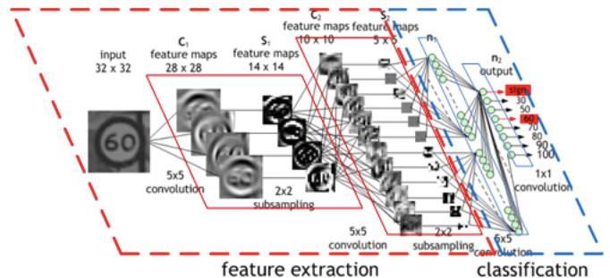

CNN MNIST 


Convolution Filter 의미 

filter 모양이 있는지 찾는다. 


Stride 

컨벌루션 필터를 지정할때 옵션을 지정한다. 


padding 

필터 특성상 이미지가 작아지느 ㄴ것을방지하기 위해 원 이미지를 키우는 것 


Max pooling 

큰값만 추출 
 (이미지 크기 줄어듬) 

 

특징 추출과 분류 





CNN은 딥러닝의 디폴트 이고 컨벌류선필터 , pandding, Max Pooling 설정 

어느 모델을 선택해서 학습 할것인가 

성능 CNN 이 더 좋다. (영상) 
CNN > DNN 


영상 CNN , 

CNN 구조를 어떻게 하느냐에 따라 서 RNN GNN 구분됨. 


수치로 나온 (iris) 같은 데이터는 1x3 의 납작한 컨벌류선필터를 적용해서 CNN 진행하면된다 CONV3D 


filter 자체가 학습 


feature 추출 하는 부분도 


분류 

기타를 하나 더 추가 해서 기타로 모인것들에 대한 따로 뽑아서 학습 


CNN 마다 구조가 다르다 


VGG16 


컨버 > 맥스풀링 > 컨버 > 맥스풀링 > 

수천개의 조합으로 VGG16 구조를 찾았다 
왜 성능이 좋은지는 설명할수가 없다. . 

결과가 잘나오는 구조를 찾는 것 

구체적인 정보  -> 개념적인 정보

XAI - 왜 성능이 좋은지 밝히는 연구하는 AI - 미국 국방성


딥러닝의 결론에 대한 설명은 할수가 없다 .


Conv1D -> 1차원  `model.add(Conv1D(4, 3, activation='relu', input_shape=(4,1)))`

CONV2D -> 2차원 

CONV3D -> 3차원 영상


VGG16


연구 Try
Try 결과
가져다 사용 시작 
패키징 일반화  (VGG16 모델) 


Mysql - 1000만 신경써야되고
oracle - 1억개에 신경써야됨 .


Overfitting 발새 안하게 하려면
파라미터 : 데이터 수 = 10:1
1억 : 1000만 


학습되어 있는 모델을 가져오고 DNN 쪽의 분류 부분학습을 하자 


리눅스 파일 커맨드 

```bach
!rm -rf dogs_prepared.tar.gz # 삭제
!wget https://github.com/dhrim/bmac_seminar/raw/master/material/deep_learning/dogs_prepared.tar.gz
!ls -al 

!rm -rf dogs_prepared
!tar xvfz dogs_prepared.tar.gz | head -20 #압축풀기
!ls -al dogs_prepared 
```


모델, 모니터 , mode='auto', seve_best_only


https://drive.google.com/file/d/1a9Z6-9wbYEsJZTll_4F3KHBUPLQMNYBG/view?usp=sharing


tensorflow.keras.applications

학습된 모델을 지원 

<https://www.tensorflow.org/api_docs/python/tf/keras/applications>

densenet module: DenseNet models for Keras.

imagenet_utils module: Utilities for ImageNet data preprocessing & prediction decoding.

inception_resnet_v2 module: Inception-ResNet V2 model for Keras.

inception_v3 module: Inception V3 model for Keras.

mobilenet module: MobileNet v1 models for Keras.

mobilenet_v2 module: MobileNet v2 models for Keras.

nasnet module: NASNet-A models for Keras.

resnet module: ResNet models for Keras.

resnet50 module: Public API for tf.keras.applications.resnet50 namespace.

resnet_v2 module: ResNet v2 models for Keras.

vgg16 module: VGG16 model for Keras.

vgg19 module: VGG19 model for Keras.

xception module: Xception V1 model for Keras.


Open Source 를 잘 가져가다가 입출력 만 잘 조정해서 사용하면 됨 Deep Learning Developer 

이런 구조로 하니 선으이 좋아지더라 

논문으로도 설명 안됨 


