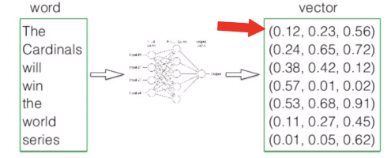

tesxt 분류기 


## 설정
VOCA_SIZE = 4000 # 어휘 사전의 크기
EMBEDDING_SIZE = 64 # 단어를 임베딩한 벡터 크기

`model.add(Embedding(VOCA_SIZE, EMBEDDING_SIZE)) # 텍스트는 임베딩 해서 사용한다.`


단어들로 사전을 만듬 

단어마다 몇번째 인지 인덱스를 만듬

단어 4000개 ~ 10000개 

단어 -> 숫자로 인코딩 


`reverse_word_index = dict([(value, key) for (key, value) in word_index.items()])`

['hello' : 1, 'world' : 2]  -> [1 : 'hello' : 1, 'world' : 2]


데이터 길이를 일정하게 만들어야 한다.


입력노드의 개수를 전부 동일하게 만들어야 한다. 

뒤에 0, 0 을 만들자 

```python
from tensorflow.keras.preprocessing import sequence

train_x = sequence.pad_sequences(train_x, maxlen=400, padding='post')
test_x = sequence.pad_sequences(test_x, maxlen=400, padding='post')
print(train_x.shape)
print(test_x.shape)
```

(25000, 400)
(25000, 400)

400개로 만들고 비어있는 곳은 0으로 채우자 

DNN의 입력의 노드 수를 400개 

그다음에 CNN 으로 넘어가서 

```python
model.add(Input(400))
model.add(Embedding(VOCA_SIZE, EMBEDDING_SIZE)) # 텍스트는 임베딩 해서 사용한다.
model.add(Dropout(0.2))
model.add(Conv1D(250, 3))   # 필터의 개수는 250개 , 필터의 사이즈는 3개 
```

1개의 워드가 64개로 변하고  (none, 400, 64) -> 256000개 로 변함


RNN 모델 


랜덤적으로 나오는 방식이 있어서 DNN으로 해결이 안된다. 그래서 나온게 RNN  

출력된 값을 저장하고 그 다음 입력이 들어오면 출력된 값을 가중치를 포함해서 입력에 포함 

학습 순서가 중요하다 

h -> e 를 학습

e -> l 을 학습

l -> l 을 학습

l -> o 을 학습

그전 입력값이 상태 입력 

hideen layer -> 이미 출력했던 imput 값의 과거가 포함되어 있다. 


RNN 셀이 몇개가 있는지 

입력 -> RNN -> RNN -> Dense -> DNN -> 출력 


아래 코드를 그림으로 설명 

입력 -> 임베드 -> RNN -> Dense -> 출력 

```python
from tensorflow.keras.preprocessing import sequence
from tensorflow.keras.models import Sequential
from tensorflow.keras.layers import Input, Dense, Dropout, Activation
from tensorflow.keras.layers import Embedding
from tensorflow.keras.layers import Conv1D, GlobalMaxPooling1D
from tensorflow.keras.layers import Bidirectional, LSTM

model = Sequential()
model.add(Input(400))
model.add(Embedding(VOCA_SIZE, EMBEDDING_SIZE))
model.add(Dropout(0.2))
# model.add(Conv1D(250, 3))
# model.add(GlobalMaxPooling1D())
model.add(Bidirectional(LSTM(64))) # ADD <-- layer 추가 
model.add(Dense(250))
model.add(Dropout(0.2))
model.add(Activation('relu'))
model.add(Dense(1))
model.add(Activation('sigmoid'))

model.summary()

model.compile(loss='binary_crossentropy', optimizer='adam', metrics=['accuracy'])
model.fit(train_x, train_y, batch_size=32, epochs=10, validation_data=(test_x, test_y))
```


```python
# model.add(Conv1D(250, 3))
# model.add(GlobalMaxPooling1D())
model.add(Bidirectional(LSTM(64))) # ADD <-- layer 추가 

# TTBP 는 200번 정도가 default  
# 과거 것도 가중치 부여 학습 
```

LSTM (Ling Short Term Memory )

RNN 의 단점을 보완한 모델 

맨처음 값이 뒤로갈수록 힘이 약해지는데 희미해지는데 그걸 방지하고 정보를 유지하게 하자 


연속적으로 바로 앞에 있는 값을 가중치를 더하기 때문에 CNN에 비해서 RNN의 학습이 10배~50배 이상 길다.


CNN -> Text 입출력 정해서 학습(임베딩) 

워드 임베딩 

Word2Vec 

인덱스로 vector 형식의 3개의 값으로 가지고 있다. 




단어들 간의 관계가 내재된다. 


구분 | --
--- | ---
DNN | BP  GD
CNN | Word2Vec |
RNN | Supervised | 
GNN | Unsupervised <br/> reinforcement  |


unet_segmentation 

디컨버 -> 데이터가 커짐 

segmentation(영역분할)

같은 사이즈의 레이러를 맞은 편의 레이어에 더 붙여서 계산


입력은 RGB로 3채널

출력은 바이너리 1개

```python

    conv5 = Conv2D(512, (3, 3), activation='relu', padding='same')(pool4)
    conv5 = BatchNormalization()(conv5)
    conv5 = Conv2D(512, (3, 3), activation='relu', padding='same')(conv5)
    conv5 = BatchNormalization()(conv5)
    

    # 데이터의 크기를 키워주는 과정 
    # 입출력을 명시 해야됨 
    up6 = concatenate([Conv2DTranspose(256, (2, 2), strides=(2, 2), padding='same')(conv5), conv4], axis=3)
    conv6 = Conv2D(256, (3, 3), activation='relu', padding='same')(up6) #입력은 up6 
    conv6 = BatchNormalization()(conv6) # 입력 con6 
    conv6 = Conv2D(256, (3, 3), activation='relu', padding='same')(conv6)
    conv6 = BatchNormalization()(conv6)
    
    up7 = concatenate([Conv2DTranspose(128, (2, 2), strides=(2, 2), padding='same')(conv6), conv3], axis=3)
    conv7 = Conv2D(128, (3, 3), activation='relu', padding='same')(up7)
    conv7 = BatchNormalization()(conv7)
    conv7 = Conv2D(128, (3, 3), activation='relu', padding='same')(conv7)
    conv7 = BatchNormalization()(conv7)
```

해야할것

모델구조는 다운로드 

데이터 로딩 -> train, test 만들고 -> 모델 생성 -> 학습 

concatenate : 합치기 


강화학습


## 얼굴인식

Face_Recognition

dlib


방법, 구조 

dlib - face detection (얼굴탐지)

face recognition(얼굴인식)

cnn - 분류 


순서

1. 타겟 탐지 작업 (네모박스)

2. 네모박스만 찾고 잘라내서 무엇인지 분류 하기 (detection + classification)


GAN

Image Translation


구조


MNIST  


DNN --출력--> Discrimistion -> 0 

0 출력되게 끔 


x --> A model --> Z --> B model --> y

B model은 학습이 되어 있음 

X model 은 x를 학습시킬때 Z가 나오게 끔 학습 시킴 

Z 의 데이터가 없음 


노이즈 차원 100

