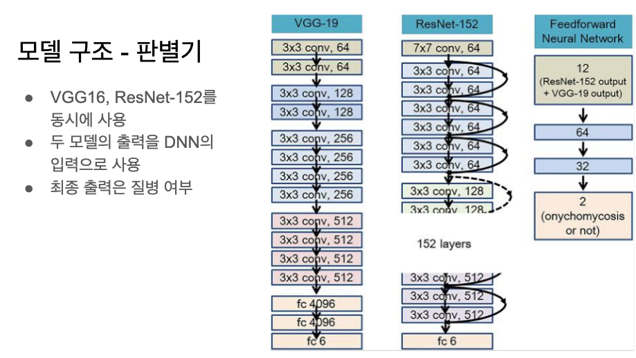

VGG16  모델이 백본으로 사용됨. 

고양이 -> VGG16 -> img 로 출력해서 고양이의 영역, 그 외의 영역 

논문 code 자료 -> copy -> 적용 -> 

분류 -> 개체 선택 -> 분류 ->  

문제를 풀기위해서 데이터를 어떻게 만들것인지?

앙상블 - 여러방법들을 써서 진짜인지 가짜인지 판별 
하나의 기준치를 임의(Max, min, avg, 다수결)로 잡고 판별기준 설정

데이터 -> VGG-19 (레이어 19개) 
데이터 -> ResNet-152
데이터 -> A Model 

앙상블 하는 방법을 DNN으로 학습 

( VGG 19 로 나온 output + ResNEt-152로 나온 output )-> 앙상블(DNN으로 학습해서 출력 )  -> 입력은 224X224 컬러영상 출력은 0과 1

차원축소 (다차원을 2차원으로 줄일때)
PCA
R-SHE

